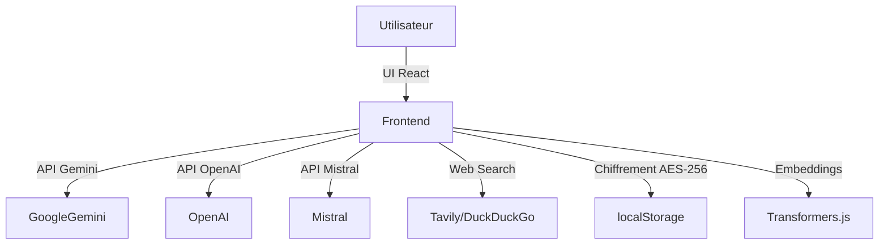

# 🏗️ ARCHITECTURE

## Vue d’ensemble

NeuroChat IA v2 est une application 100% frontend, sécurisée, orientée IA conversationnelle et multimodale. Elle fonctionne sans backend applicatif : toutes les données sensibles sont chiffrées et stockées localement (localStorage/sessionStorage), et les appels aux API IA se font directement depuis le navigateur.

---

## Schéma général

---

## Frontend

- **React 18 + TypeScript + Vite**
- **UI/UX** : Tailwind CSS, Radix UI, Lucide React
- **Composants principaux** :
  - ChatContainer, MessageBubble, VoiceInput, VocalModeIndicator, Header, HistoryModal, RagDocsModal, RagSidebar, RagSidebarDrawer, MemoryModal, TTSSettingsModal, PrivateModeBanner, ChildMode*, WebSources*
- **Hooks personnalisés** :
  - useSpeechRecognition, useSpeechSynthesis, useDiscussions, useTheme, useWorkspace
- **Gestion d’état** : React state, context, hooks

---

## Services & API internes

- **geminiApi.ts** : Appels à Google Gemini Pro
- **openaiApi.ts** : Appels à OpenAI (optionnel)
- **mistralApi.ts** : Appels à Mistral (optionnel)
- **llm.ts** : Abstraction multi-provider
- **embeddings.ts** : Embeddings locaux (MiniLM via transformers.js)
- **ragSearch.ts** : Recherche sémantique sur documents importés
- **webSearch.ts** : Recherche web (Tavily/DuckDuckGo)
- **encryption.ts** : Chiffrement AES-256-GCM
- **keyManager.ts** : Gestion des clés cryptographiques
- **secureStorage.ts** : Stockage sécurisé (localStorage/sessionStorage)
- **persistentEncryption.ts** : Chiffrement persistant

---

## Logique de persistance

- **localStorage/sessionStorage** : Toutes les données sensibles (messages, mémoire, documents RAG, clés, stats) sont chiffrées avant stockage.
- **secureStorage.ts** : Interface universelle, auto-destruction en mode privé, whitelist des clés non chiffrées.
- **keyManager.ts** : Rotation automatique, audit trail, dérivation hiérarchique, destruction programmée.

---

## Sécurité

- **AES-256-GCM** : Chiffrement permanent et obligatoire
- **PBKDF2** : Dérivation de clé (600k itérations)
- **WebCrypto API** : Génération et gestion des clés
- **Modes** :
  - Normal : chiffrement persistant
  - Privé : chiffrement + auto-destruction
  - Enfant : chiffrement + restrictions

---

## Backend

- **Aucun backend applicatif** : Toutes les opérations sont locales ou via API IA (Gemini, OpenAI, Mistral)
- **Pas de serveur tiers** : Sécurité et vie privée maximales

---

## Résumé

NeuroChat IA v2 combine une architecture frontend moderne, une sécurité de niveau gouvernemental, et une logique de persistance avancée, le tout sans backend applicatif.