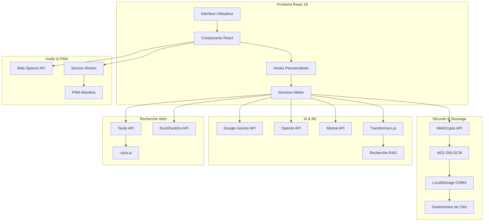
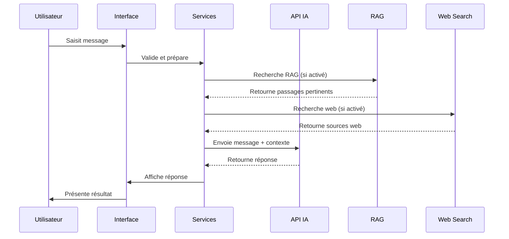
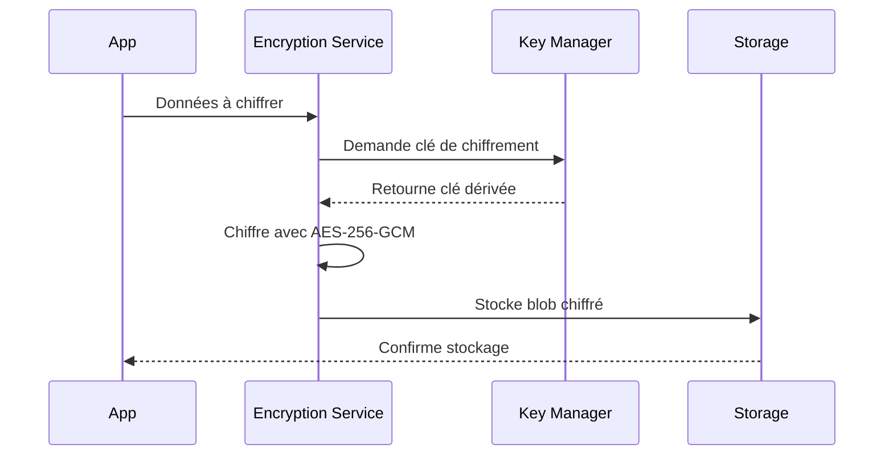

# 🏗️ Architecture NeuroChat-IA-v2

## Vue d'Ensemble

NeuroChat-IA-v2 est une **application frontend moderne** construite avec React 18, TypeScript et Vite. Elle implémente une architecture **sans backend applicatif** où toutes les données sensibles sont chiffrées et stockées localement, et les appels aux API IA se font directement depuis le navigateur.

## 🎯 Principes Architecturaux

### 🔐 Sécurité First
- **Chiffrement AES-256-GCM** obligatoire pour toutes les données sensibles
- **Aucune donnée en clair** dans le localStorage/sessionStorage
- **WebCrypto API** pour la génération et gestion des clés
- **Modes de sécurité** : Normal, Privé (auto-destruction), Enfant (restrictions)

### 🚀 Performance & UX
- **Lazy loading** des composants lourds
- **Virtualisation** des listes avec react-virtuoso
- **Code splitting** dynamique avec Vite
- **PWA complète** avec Service Worker et installation native

### 🧠 Intelligence Distribuée
- **Multi-provider** avec fallback automatique (Gemini, OpenAI, Mistral)
- **RAG local** avec embeddings MiniLM via transformers.js
- **Recherche web** intelligente (Tavily + DuckDuckGo fallback)
- **Heuristiques automatiques** pour l'activation contextuelle

## 📊 Schéma Architectural



## 🏛️ Structure Détaillée

### Frontend (React 18 + TypeScript)

#### Composants Principaux
```
src/components/
├── ui/                     # Composants UI de base (shadcn/ui + Radix UI)
│   ├── button.tsx         # Boutons avec variants
│   ├── dialog.tsx         # Modales accessibles
│   ├── input.tsx          # Champs de saisie
│   ├── sheet.tsx          # Panneaux latéraux
│   └── ...
├── ChatContainer.tsx       # Zone de conversation principale
├── MessageBubble.tsx       # Bulles de message avec actions
├── VoiceInput.tsx         # Saisie vocale/texte + images
├── VocalModeIndicator.tsx # Indicateur vocal flottant
├── Header.tsx             # Navigation et actions
├── HistoryModal.tsx       # Historique des discussions
├── RagDocsModal.tsx       # Gestion documents RAG
├── RagSidebar.tsx         # Sidebar RAG desktop
├── RagSidebarDrawer.tsx   # Sidebar RAG mobile
├── TTSSettingsModal.tsx   # Réglages synthèse vocale
├── PrivateModeBanner.tsx  # Bannière mode privé
├── ChildMode*.tsx          # Composants mode enfant
├── WebSources*.tsx         # Sources web utilisées
└── ...
```

#### Hooks Personnalisés
```
src/hooks/
├── useSpeechRecognition.ts  # Reconnaissance vocale (Web Speech API)
├── useSpeechSynthesis.ts    # Synthèse vocale configurable
├── useDiscussions.ts        # Gestion des discussions/messages
├── useTheme.ts              # Gestion du thème (clair/sombre)
├── useWorkspace.ts          # Gestion des espaces de travail
├── usePWA.ts                # Fonctionnalités PWA
└── use-toast.ts             # Notifications toast
```

### Services Métier

#### APIs IA
```
src/services/
├── geminiApi.ts            # Appels à Google Gemini Pro (multimodal)
├── openaiApi.ts            # Appels à OpenAI (optionnel)
├── mistralApi.ts           # Appels à Mistral (optionnel)
├── llm.ts                  # Abstraction multi-provider avec fallback
└── geminiSystemPrompt.ts   # Prompts système configurables
```

#### Intelligence Locale
```
src/services/
├── embeddings.ts            # Embeddings MiniLM via transformers.js
├── ragSearch.ts            # Recherche sémantique sur documents
└── webSearch.ts            # Recherche web (Tavily/DuckDuckGo)
```

#### Sécurité & Chiffrement
```
src/services/
├── encryption.ts            # Chiffrement AES-256-GCM principal
├── keyManager.ts           # Gestion des clés cryptographiques
├── secureStorage.ts        # Stockage sécurisé (localStorage/sessionStorage)
└── persistentEncryption.ts # Chiffrement persistant pour mode normal
```

## 🔐 Architecture de Sécurité

### Chiffrement AES-256-GCM

```typescript
// Configuration cryptographique
const CRYPTO_CONFIG = {
  ALGORITHM: 'AES-GCM',
  KEY_LENGTH: 256,        // bits - AES-256
  IV_LENGTH: 96,         // bits - recommandé pour GCM
  SALT_LENGTH: 256,      // bits - haute entropie
  TAG_LENGTH: 128,       // bits - authentification
  PBKDF2_ITERATIONS: 600000, // 600k itérations (OWASP 2023)
  PBKDF2_HASH: 'SHA-256',
  ENCODING: 'base64'
};
```

### Structure des Données Chiffrées

```typescript
interface EncryptedBlob {
  version: 'v1';
  algorithm: 'AES-GCM';
  data: string;        // Données chiffrées (base64)
  iv: string;          // Vecteur d'initialisation (base64)
  salt: string;        // Sel pour dérivation de clé (base64)
  tag: string;         // Tag d'authentification (base64)
  iterations: number;  // Nombre d'itérations PBKDF2
  timestamp: number;   // Horodatage de chiffrement
}
```

### Modes de Sécurité

#### Mode Normal
- **Chiffrement persistant** : Données chiffrées et récupérables
- **Clés dérivées** : PBKDF2 avec mot de passe utilisateur
- **Cache sécurisé** : Clés en mémoire avec expiration automatique
- **Récupération** : Déchiffrement automatique au chargement

#### Mode Privé
- **Auto-destruction** : Données effacées à la fermeture
- **Session uniquement** : Aucune persistance
- **Clés temporaires** : Génération automatique sans mot de passe
- **Nettoyage** : Destruction programmée des clés

#### Mode Enfant
- **Restrictions** : Accès limité aux fonctionnalités sensibles
- **PIN protection** : Authentification requise pour désactiver
- **Filtrage** : Contenu adapté aux enfants
- **Chiffrement** : Même niveau de sécurité que mode normal

## 🧠 Architecture IA & ML

### Multi-Provider avec Fallback

```typescript
// Ordre de fallback configurable
const providersToTry: Provider[] = [
  primary,                    // Provider principal
  ...allProviders.filter(p => p !== primary), // Autres providers
  ...fallbackOrder           // Ordre personnalisé
];

// Tentative séquentielle avec gestion d'erreurs
for (const provider of providersToTry) {
  try {
    return await sendMessageToProvider(provider, ...);
  } catch (err) {
    // Essayer le prochain provider
    continue;
  }
}
```

### RAG Local avec Embeddings

```typescript
// Pipeline RAG
1. Import de documents (TXT, MD, PDF, DOCX, CSV, HTML)
2. Extraction de texte (PDF.js, Mammoth, PapaParse)
3. Génération d'embeddings (MiniLM via transformers.js)
4. Stockage local chiffré
5. Recherche par similarité cosinus
6. Injection contextuelle dans le prompt
```

### Recherche Web Intelligente

```typescript
// Stratégie de recherche web
1. Tentative Tavily API (si clé disponible)
2. Fallback DuckDuckGo Instant Answer
3. Enrichissement optionnel via r.jina.ai
4. Filtrage des domaines bloqués
5. Limitation du nombre de résultats
```

## 🎤 Architecture Audio

### Reconnaissance Vocale

```typescript
// Web Speech API avec gestion d'erreurs
const recognition = new (window.SpeechRecognition || window.webkitSpeechRecognition)();
recognition.lang = 'fr-FR';
recognition.continuous = true;
recognition.interimResults = true;

// Gestion des événements
recognition.onresult = (event) => {
  const transcript = Array.from(event.results)
    .map(result => result[0].transcript)
    .join('');
  // Traitement du transcript
};
```

### Synthèse Vocale

```typescript
// Configuration avancée TTS
const utterance = new SpeechSynthesisUtterance(text);
utterance.rate = rate;      // Vitesse (0.1 - 10)
utterance.pitch = pitch;    // Tonalité (0 - 2)
utterance.volume = volume;  // Volume (0 - 1)
utterance.voice = selectedVoice; // Voix spécifique
utterance.lang = 'fr-FR';   // Langue
```

## 📱 Architecture PWA

### Service Worker

```typescript
// Stratégies de cache
const CACHE_STRATEGIES = {
  'static': 'cache-first',      // CSS, JS, images
  'api': 'network-first',       // Appels API
  'documents': 'stale-while-revalidate' // Documents RAG
};

// Gestion des événements
self.addEventListener('fetch', (event) => {
  const strategy = getStrategy(event.request);
  event.respondWith(strategy(event.request));
});
```

### Manifest PWA

```json
{
  "name": "NeuroChat IA",
  "short_name": "NeuroChat",
  "description": "Assistant IA conversationnel intelligent",
  "start_url": "/",
  "display": "standalone",
  "background_color": "#ffffff",
  "theme_color": "#3b82f6",
  "icons": [...],
  "shortcuts": [
    {
      "name": "Nouvelle discussion",
      "short_name": "Nouveau",
      "description": "Créer une nouvelle conversation",
      "url": "/?action=new",
      "icons": [...]
    }
  ]
}
```

## 🔄 Flux de Données

### Envoi de Message



### Chiffrement des Données



## 🚀 Optimisations de Performance

### Lazy Loading

```typescript
// Composants lourds chargés à la demande
const TTSSettingsModalLazy = lazy(() => 
  import('@/components/TTSSettingsModal')
    .then(m => ({ default: m.TTSSettingsModal }))
);

// Utilisation avec Suspense
<Suspense fallback={<Loading />}>
  <TTSSettingsModalLazy {...props} />
</Suspense>
```

### Virtualisation

```typescript
// Liste virtuelle pour les messages
<Virtuoso
  ref={virtuosoRef}
  data={messages}
  itemContent={(index, message) => (
    <MessageBubble key={message.id} message={message} />
  )}
  followOutput="smooth"
  atBottomStateChange={handleAtBottomChange}
/>
```

### Code Splitting

```typescript
// Configuration Vite pour le code splitting
export default defineConfig({
  build: {
    rollupOptions: {
      output: {
        manualChunks: {
          pdfjs: ['pdfjs-dist'],
          mammoth: ['mammoth'],
          xenova: ['@xenova/transformers'],
          radix: ['@radix-ui/react-dialog', ...]
        }
      }
    }
  }
});
```

## 🔧 Configuration & Déploiement

### Variables d'Environnement

```bash
# API Keys (minimum Gemini requis)
VITE_GEMINI_API_KEY=your_gemini_key
VITE_OPENAI_API_KEY=your_openai_key
VITE_MISTRAL_API_KEY=your_mistral_key
VITE_TAVILY_API_KEY=your_tavily_key

# Configuration
VITE_OPENAI_MODEL=gpt-4o-mini
VITE_MISTRAL_MODEL=mistral-small-latest
```

### Build & Déploiement

```bash
# Développement
npm run dev

# Build production
npm run build

# Build PWA optimisé
npm run build:pwa

# Prévisualisation
npm run preview
```

## 📊 Monitoring & Observabilité

### Métriques de Performance

- **Core Web Vitals** : LCP, FID, CLS
- **Bundle Size** : Taille des chunks JavaScript
- **Cache Hit Rate** : Efficacité du cache PWA
- **API Response Time** : Latence des appels IA

### Monitoring de Sécurité

- **Chiffrement Status** : Vérification du chiffrement actif
- **Key Rotation** : Rotation automatique des clés
- **Access Logs** : Audit des accès aux données sensibles
- **Error Tracking** : Surveillance des erreurs cryptographiques

## 🔮 Évolutions Futures

### Architecture Cible

- **Microservices** : Séparation des responsabilités
- **Event Sourcing** : Traçabilité complète des événements
- **CQRS** : Séparation lecture/écriture
- **GraphQL** : API unifiée pour les données

### Intégrations Avancées

- **Vector Database** : Base de données vectorielle pour les embeddings
- **Message Queue** : Queue pour les tâches asynchrones
- **Real-time Sync** : Synchronisation temps réel entre appareils
- **Analytics** : Métriques avancées et insights utilisateur

---

Cette architecture garantit une application **sécurisée**, **performante** et **évolutive** tout en maintenant la simplicité d'utilisation et la facilité de déploiement.