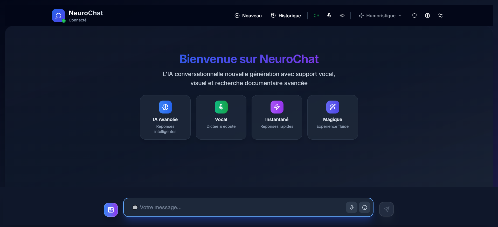

# 🧠 NeuroChat-IA-v2

**Assistant IA conversationnel intelligent et sécurisé** avec support multi-providers, chiffrement AES-256 niveau gouvernemental, RAG local, synthèse vocale et modes de sécurité avancés.

[](./README.md)
[](./LICENSE)
[](https://react.dev/)
[](https://www.typescriptlang.org/)
[](./README.md)
[](https://chat-gemini-coral.vercel.app)
[](https://vercel.com/)
[](https://github.com/moonback/NeuroChat-IA-v2)
[](https://github.com/moonback/NeuroChat-IA-v2/graphs/contributors)

<div align="center">


<p><em>Interface moderne avec mode vocal automatique, mémoire, RAG local et protection AES-256</em></p>

</div>

## ✨ Fonctionnalités Principales

### 🎤 **Interface Vocale Avancée**
- **Mode vocal automatique** : Reconnaissance vocale continue avec bip de reprise
- **Reconnaissance vocale** : Web Speech API (fr-FR) avec transcription en temps réel
- **Synthèse vocale** : Configuration avancée (vitesse, tonalité, volume, voix)
- **Indicateur vocal flottant** : Déplaçable, minimisable avec état visuel

### 💬 **Chat Intelligent Multi-Modal**
- **Interface fluide** : Animations, scroll virtuel, design responsive
- **Support images** : Analyse via Gemini (multimodal) avec upload direct
- **Sélection multiple** : Suppression groupée de messages
- **Vue Infos** : Statistiques conversation, contexte RAG, métadonnées

### 🤖 **Agents & Multi-Provider**
- **Agents intelligents** : Gemini et Mistral avec orchestration automatique
- **Heuristiques automatiques** : Activation Web/RAG selon mots-clés configurables
- **Multi-fournisseurs** : Gemini, OpenAI, Mistral avec fallback automatique
- **Gestion d'erreurs** : Basculement transparent entre providers

### 🧠 **RAG (Recherche Augmentée) Local**
- **Import de documents** : TXT, MD, PDF, DOCX, CSV, HTML
- **Embeddings locaux** : MiniLM via transformers.js avec similarité cosinus
- **Recherche sémantique** : Activation/désactivation à la volée
- **Sidebar intelligente** : Stats, favoris, pagination des documents

### 🔍 **Recherche Web Intelligente**
- **Tavily API** : Recherche web avancée (si clé API fournie)
- **Fallback DuckDuckGo** : Instant Answer API en cas d'échec
- **Enrichissement** : Extraction de contenu via r.jina.ai
- **Sources web** : Sidebar avec historique et métadonnées

### 🔐 **Sécurité Niveau Gouvernemental**
- **Chiffrement AES-256-GCM** : Protection permanente et obligatoire
- **PBKDF2** : Dérivation de clé avec 600,000 itérations
- **Modes de sécurité** :
  - **Normal** : Chiffrement persistant avec récupération sécurisée
  - **Privé** : Chiffrement + auto-destruction, aucune persistance
  - **Enfant** : Chiffrement + restrictions de contenu (PIN ≥ 4 chiffres)
- **WebCrypto API** : Génération et gestion sécurisée des clés

### ⚙️ **Configuration Avancée**
- **Hyperparamètres** : Temperature, topK, topP, maxOutputTokens pour chaque provider
- **TTS avancé** : Test, export/import, reset, suppression des paramètres
- **Thème adaptatif** : Clair/sombre avec gradients de sécurité
- **Espaces de travail** : Gestion multi-projets avec chiffrement séparé

## 🚀 Installation Rapide

### Prérequis
- **Node.js** 18+ (recommandé)
- **Clé API Gemini** (gratuite via [Google AI Studio](https://makersuite.google.com/app/apikey))

### Installation en 3 étapes

```bash
# 1) Cloner et installer
git clone https://github.com/moonback/NeuroChat-IA-v2.git
cd NeuroChat-IA-v2
npm install

# 2) Configurer les API (minimum Gemini requis)
cat > .env.local << EOF
VITE_GEMINI_API_KEY=votre_cle_api_gemini
# (Optionnel) OpenAI
VITE_OPENAI_API_KEY=your_openai_key
VITE_OPENAI_MODEL=gpt-4o-mini
# (Optionnel) Mistral
VITE_MISTRAL_API_KEY=your_mistral_key
VITE_MISTRAL_MODEL=mistral-small-latest
# (Optionnel) Recherche Web Tavily
VITE_TAVILY_API_KEY=your_tavily_key
EOF

# 3) Lancer en développement
npm run dev
```

Ouvrez `http://localhost:5173` dans votre navigateur.

**Production** : `npm run build` puis `npm run preview`

## 📖 Guide d'Utilisation

### 🎤 Mode Vocal Automatique
1. Activez le mode vocal dans l'en-tête
2. Parlez naturellement : l'IA écoute en continu
3. L'indicateur flottant affiche l'état (écoute/analyse/réponse)
4. Déplacez, réduisez ou agrandissez l'indicateur

### 💬 Chat & Images
- Saisissez du texte ou cliquez sur l'icône image pour joindre un fichier (JPG/PNG/WebP)
- Si une image est fournie, l'analyse est intégrée à la réponse

### 🤖 Agents et Heuristiques Automatiques
- Activez l'Agent depuis le bouton dédié dans la zone d'entrée (Gemini/Mistral)
- Dans les réglages du provider : cochez « Activer RAG auto » / « Activer Web auto »
- Le modèle déclenche Web/RAG automatiquement selon votre requête

### 🧠 RAG (Recherche Augmentée)
1. Activez le mode RAG (icône cerveau)
2. Importez vos documents via « Documents RAG » (TXT/MD/PDF/DOCX/CSV/HTML)
3. Posez vos questions : les passages pertinents sont injectés dans le contexte

### 🔐 Sécurité et Chiffrement
- **Chiffrement automatique** : Toutes les données sont automatiquement chiffrées avec AES-256-GCM
- **Badge de sécurité** : L'indicateur "AES-256" dans l'en-tête confirme la protection active
- **Mode privé** : Activez le bouclier dans le header pour un chiffrement avec auto-destruction
- **Récupération sécurisée** : En mode normal, vos données sont chiffrées mais récupérables

### 👶 Mode Enfant
1. Activez via l'icône dédiée
2. À la première activation, définissez un PIN (≥ 4 chiffres)
3. Pour désactiver, ressaisissez le PIN
4. En mode enfant : mémoire, RAG et réglages sont masqués

## 🧰 Stack Technique

| Catégorie | Technologies |
|-----------|--------------|
| **Frontend** | React 18, TypeScript, Vite |
| **UI/UX** | Tailwind CSS, Radix UI, Lucide React |
| **IA** | Google Gemini Pro API (multimodal), OpenAI (optionnel), Mistral (optionnel) |
| **Audio** | Web Speech API (reconnaissance & synthèse) |
| **ML Local** | `@xenova/transformers` (embeddings MiniLM) |
| **🔐 Sécurité** | **AES-256-GCM, PBKDF2 (600k itérations), WebCrypto API** |
| **Données** | LocalStorage chiffré, SessionStorage sécurisé |
| **Recherche Web** | Tavily (optionnel), DuckDuckGo (fallback), r.jina.ai (extraits) |
| **PWA** | Service Worker, Manifest, Installation native |

## 📂 Architecture du Projet

```
src/
├── components/          # Composants React réutilisables
│   ├── ui/             # Composants UI de base (shadcn/ui + Radix UI)
│   ├── ChatContainer.tsx        # Zone de conversation principale
│   ├── MessageBubble.tsx        # Bulles de message avec actions
│   ├── VoiceInput.tsx           # Saisie vocale/texte + images
│   ├── VocalModeIndicator.tsx   # Indicateur vocal flottant
│   ├── Header.tsx               # Navigation et actions (badge AES-256)
│   ├── HistoryModal.tsx         # Historique des discussions
│   ├── RagDocsModal.tsx         # Gestion documents RAG
│   ├── RagSidebar.tsx           # Sidebar RAG (stats, favoris, pagination)
│   ├── RagSidebarDrawer.tsx     # Version mobile (drawer)
│   ├── TTSSettingsModal.tsx     # Réglages synthèse vocale
│   ├── PrivateModeBanner.tsx    # Bannière mode privé
│   ├── ChildMode*.tsx           # PIN, bannière, changement PIN
│   ├── WebSources*.tsx          # Sources web utilisées
│   └── ...
├── hooks/              # Hooks React personnalisés
│   ├── useSpeechRecognition.ts
│   ├── useSpeechSynthesis.ts
│   ├── useDiscussions.ts
│   ├── useTheme.ts
│   ├── useWorkspace.ts
│   └── usePWA.ts
├── services/           # Services métier et API
│   ├── geminiApi.ts             # Appels Gemini
│   ├── openaiApi.ts             # OpenAI (optionnel)
│   ├── mistralApi.ts            # Mistral (optionnel)
│   ├── llm.ts                   # Abstraction provider
│   ├── geminiSystemPrompt.ts    # Prompts système
│   ├── embeddings.ts            # Embeddings + similarité
│   ├── ragSearch.ts             # Recherche sémantique des docs
│   ├── webSearch.ts             # Recherche web (optionnel)
│   ├── 🔐 encryption.ts         # **Chiffrement AES-256-GCM**
│   ├── 🔐 keyManager.ts         # **Gestion des clés cryptographiques**
│   ├── 🔐 secureStorage.ts      # **Stockage sécurisé**
│   └── 🔐 persistentEncryption.ts # **Chiffrement persistant**
├── lib/
│   └── utils.ts
├── types/
│   └── pwa.d.ts
├── App.tsx
└── main.tsx
```

## 📱 Compatibilité

- **Reconnaissance vocale** : Chrome ✅, Edge ✅, Safari (iOS 14+/macOS 12+) ✅, Firefox ❌
- **Synthèse vocale** : Tous les navigateurs modernes ✅ (desktop & mobile)
- **🔐 Chiffrement** : **Tous les navigateurs modernes avec WebCrypto API ✅**
- **PWA** : Chrome ✅, Edge ✅, Safari (iOS 16.4+) ✅, Firefox ✅
- **Fonctionnalités avancées** : Embeddings locaux, File API, LocalStorage

## 🔒 Sécurité & Vie Privée

### 🛡️ Protection AES-256 de Niveau Gouvernemental
- **Chiffrement obligatoire** : AES-256-GCM avec PBKDF2 (600,000 itérations)
- **Authentification intégrée** : AEAD (Authenticated Encryption with Associated Data)
- **Clés sécurisées** : Génération cryptographiquement sûre via WebCrypto API
- **Protection complète** : Messages, historique, documents RAG, configuration
- **Mode privé** : Chiffrement avec auto-destruction, aucune persistance
- **Mode normal** : Chiffrement persistant avec récupération sécurisée

### 🔐 Fonctionnalités de Sécurité
- Clé API locale via `VITE_GEMINI_API_KEY` (fichier `.env.local`)
- Filtres de sécurité activés côté Gemini (safetySettings)
- Données locales chiffrées sur votre appareil
- Pas de serveur applicatif tiers : appels directs aux API (Google/OpenAI/Mistral)
- Suppression simple depuis l'interface
- **Aucune possibilité de désactiver le chiffrement** - Protection permanente

### 🚨 Modes de Sécurité
- **Mode normal** : Chiffrement AES-256 permanent, données récupérables
- **Mode privé** : Chiffrement AES-256 + auto-destruction, aucune trace
- **Mode enfant** : Chiffrement + restrictions de contenu et fonctionnalités

## 🚨 Dépannage

### « API key not found »
```bash
# Vérifiez votre fichier .env.local
cat .env.local
# Doit contenir : VITE_GEMINI_API_KEY=votre_cle

# Relancez le serveur
npm run dev
```

### Reconnaissance vocale inactive
- Utilisez Chrome/Edge (recommandé)
- Vérifiez les permissions microphone (OS/navigateur)
- Testez en HTTPS en production
- Assurez-vous que le micro n'est pas utilisé ailleurs

### Synthèse vocale muette
- Vérifiez le volume système & navigateur
- Testez via le bouton « Test » dans les réglages TTS
- Changez de voix système
- Réinitialisez les paramètres TTS

### RAG ne renvoie rien
- Vérifiez l'import de documents
- Utilisez des mots-clés précis
- Essayez avec des documents plus courts
- Réactivez le mode RAG

### Recherche Web vide
- Ajoutez `VITE_TAVILY_API_KEY` pour des résultats plus riches
- Réessayez avec des requêtes plus précises
- Vérifiez la connectivité réseau et les limitations CORS

### 🔐 Problèmes de Chiffrement
- **Chiffrement désactivé** : Le chiffrement est maintenant permanent et ne peut être désactivé
- **Données non récupérables** : Vérifiez que vous êtes en mode normal (pas en mode privé)
- **Erreur de déchiffrement** : Les données sont automatiquement chiffrées, aucun mot de passe requis

## 🔧 Scripts Disponibles

```bash
# Développement (hot reload)
npm run dev

# Build production
npm run build

# Build PWA optimisé
npm run build:pwa

# Test PWA
npm run test:pwa

# Prévisualisation du build
npm run preview

# Lint (ESLint)
npm run lint

# Audit PWA avec Lighthouse
npm run pwa:audit

# Vérification TypeScript (sans émettre)
npx tsc --noEmit
```

## 🤝 Contribution

1) **Préparer l'environnement**
```bash
git clone https://github.com/moonback/NeuroChat-IA-v2.git
cd NeuroChat-IA-v2
npm install
```

2) **Créer une branche**
```bash
git checkout -b feature/ma-nouvelle-fonctionnalite
```

3) **Développer et tester**
```bash
npm run dev
npm run lint
```

4) **Commiter et pousser**
```bash
git add .
git commit -m "feat: ajouter ma nouvelle fonctionnalité"
git push origin feature/ma-nouvelle-fonctionnalite
```

5) **Ouvrir une Pull Request**
- Décrivez clairement vos changements
- Ajoutez des captures d'écran si utile
- Mentionnez les issues liées

Voir [CONTRIBUTING.md](./CONTRIBUTING.md) pour plus de détails.

## 📈 Roadmap

### ✅ MVP (Livré)
- Chat IA multimodal (texte, image)
- Mode vocal automatique
- RAG local (import de documents, embeddings, recherche sémantique)
- Sécurité AES-256-GCM (chiffrement permanent)
- Multi-provider (Gemini, OpenAI, Mistral)
- Mode privé et mode enfant
- UI moderne (Radix UI, Tailwind, animations)
- PWA complète avec installation native

### 🚧 V1 (En cours)
- Export avancé des conversations (PDF/Markdown)
- Raccourcis clavier complets
- Personnalités personnalisées (agents)
- Fonctionnement hors-ligne étendu
- Partage de conversations
- Monitoring sécurité et performance

### 🔮 Fonctionnalités Futures
- Support des clés matérielles (HSM)
- Indexation avancée (clustering, suggestions automatiques)
- Compression et optimisation du stockage
- Synchronisation cloud optionnelle
- Visualisation des relations entre documents
- Recherche prédictive et suggestions intelligentes
- API publique pour intégration tierce

Voir [ROADMAP.md](./ROADMAP.md) pour plus de détails.

## 📸 Captures d'Écran

- Interface principale, mode vocal, RAG, mode privé, mode enfant
- Fichier existant : `public/neurochat-screenshot.png`

## 🙏 Remerciements

- [Google Gemini Pro](https://ai.google.dev/) — moteur IA principal
- [Radix UI](https://radix-ui.com/) — primitives UI accessibles
- [Lucide React](https://lucide.dev/) — icônes modernes
- [Tailwind CSS](https://tailwindcss.com/) — framework CSS utilitaire
- [Vite](https://vitejs.dev/) — build ultra-rapide
- [Xenova/transformers](https://huggingface.co/docs/transformers.js/) — ML dans le navigateur
- [React](https://react.dev/) — bibliothèque UI
- **🔐 WebCrypto API** — Standard de chiffrement moderne

## 📄 Licence

Projet sous licence MIT — voir [LICENSE](./LICENSE).

---

**NeuroChat-IA-v2** - *Assistant IA conversationnel intelligent et sécurisé* 🧠✨