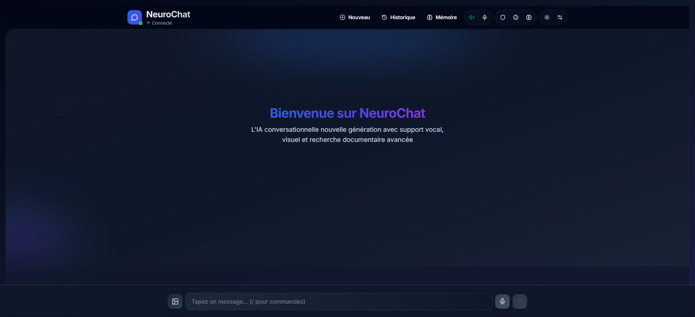

### 🧠 NeuroChat IA v2

> Assistant IA moderne (React + TypeScript) avec voix, images, mémoire utilisateur, RAG local, mode privé et mode enfant — propulsé par Gemini Pro.

[](./README.md)
[](./LICENSE)
[](https://github.com/your-username/NeuroChat-IA-v2/actions)
[](https://react.dev/)
[](https://www.typescriptlang.org/)
[](https://github.com/your-username/NeuroChat-IA-v2)
[](https://github.com/your-username/NeuroChat-IA-v2/graphs/contributors)
[](https://vercel.com/)

<div align="center">


<p><em>Interface moderne avec mode vocal automatique, mémoire et RAG local</em></p>

</div>


## ✨ Fonctionnalités

- **Voix**
  - Mode vocal automatique (mains libres) avec bip de reprise
  - Reconnaissance vocale (Web Speech API, fr-FR)
  - Synthèse vocale configurable (vitesse, tonalité, volume, voix)
  - Indicateur vocal flottant (déplaçable, minimisable, transcription en temps réel)

- **Chat**
  - UI fluide et réactive (animations, scroll virtuel)
  - Images: envoi et analyse via Gemini (multimodal)
  - Sélection multiple et suppression groupée
  - Vue Infos: stats conversation, contexte RAG, date de début

- **Mémoire utilisateur**
  - Extraction de faits (profil, préférences, objectifs) + fallback LLM
  - Gestion: ajout/édition/désactivation/export/import
  - Recherche sémantique via embeddings locaux (MiniLM / transformers.js)
  - Commandes: `/memoir ... tags:a,b importance:4`, `/supp ...`, `/memlist [query]`

- **RAG (Recherche augmentée)**
  - Import: TXT, MD, PDF, DOCX, CSV, HTML
  - Embeddings locaux + similarité cosinus
  - Activation/désactivation à la volée

- **Sécurité & modes**
  - Mode privé: aucune persistance; alerte à la fermeture si messages présents
  - Mode enfant (PIN ≥ 4 chiffres): ton adapté, contenus filtrés, mémoire/RAG/réglages masqués

- **Réglages & historique**
  - Hyperparamètres Gemini (temperature, topK, topP, maxOutputTokens)
  - TTS: test, export/import, reset, suppression
  - Thème clair/sombre
  - Historique local (recherche, tri, renommage, suppression simple et multiple)


## 🚀 Installation

### Prérequis
- Node.js 18+ (recommandé)
- Clé API Google Gemini (gratuite via `https://makersuite.google.com/app/apikey`)

### Installation rapide

```bash
# 1) Cloner et installer
git clone https://github.com/your-username/NeuroChat-IA-v2.git
cd NeuroChat-IA-v2
npm install

# 2) Configurer l’API Gemini
echo "VITE_GEMINI_API_KEY=votre_cle_api_gemini" > .env.local

# 3) Lancer en développement
npm run dev
```

Ouvrez `http://localhost:5173` dans votre navigateur.

Production: `npm run build` puis `npm run preview`.


## 📖 Guide d’utilisation

### Mode vocal automatique
1. Activez le mode vocal dans l’en‑tête
2. Parlez naturellement: l’IA écoute en continu
3. L’indicateur flottant affiche l’état (écoute/analyse/réponse)
4. Déplacez, réduisez ou agrandissez l’indicateur

### Chat & images
- Saisissez du texte ou cliquez sur l’icône image pour joindre un fichier (JPG/PNG/WebP)
- Si une image est fournie, l’analyse est intégrée à la réponse

### Mémoire utilisateur
- Ouvrez la modale « Mémoire » pour gérer vos faits
- Commandes utiles:
  - Ajouter: `/memoir J’aime le thé au jasmin tags:boisson,goûts importance:4`
  - Supprimer: `/supp J’aime le thé au jasmin`
  - Lister/Rechercher: `/memlist`, `/memlist thé`
- Export/Import JSON; possibilité de désactiver un élément

### RAG (Recherche augmentée)
1. Activez le mode RAG (icône cerveau)
2. Importez vos documents via « Documents RAG » (TXT/MD/PDF/DOCX/CSV/HTML)
3. Posez vos questions: les passages pertinents sont injectés dans le contexte

### Mode privé
- Activez le bouclier dans le header; rien n’est sauvegardé (alerte à la fermeture)

### Mode enfant
1. Activez via l’icône dédiée
2. À la première activation, définissez un PIN (≥ 4 chiffres)
3. Pour désactiver, ressaisissez le PIN
4. Option « Changer le PIN (mode enfant) » disponible dans le menu mobile
5. En mode enfant: mémoire, RAG et réglages sont masqués


## 🧰 Stack technique

| Catégorie | Technologies |
|---|---|
| **Frontend** | React 18, TypeScript, Vite |
| **UI/UX** | Tailwind CSS, Radix UI, Lucide React |
| **IA** | Google Gemini Pro API (multimodal), OpenAI (optionnel) |
| **Audio** | Web Speech API (reconnaissance & synthèse) |
| **ML local** | `@xenova/transformers` (embeddings) |
| **Données** | LocalStorage |


## 📂 Architecture

```
src/
├── components/
│   ├── ui/                      # Primitives UI (Radix/Shadcn)
│   ├── ChatContainer.tsx        # Zone de conversation
│   ├── MessageBubble.tsx        # Bulles de message
│   ├── VoiceInput.tsx           # Saisie vocale/texte + images
│   ├── VocalModeIndicator.tsx   # Indicateur vocal flottant
│   ├── Header.tsx               # Navigation et actions
│   ├── HistoryModal.tsx         # Historique des discussions
│   ├── RagDocsModal.tsx         # Gestion documents RAG
│   ├── RagSidebar.tsx           # Sidebar RAG (stats, favoris, pagination)
│   ├── RagSidebarDrawer.tsx     # Version mobile (drawer)
│   ├── MemoryModal.tsx          # Gestion mémoire utilisateur
│   ├── TTSSettingsModal.tsx     # Réglages synthèse vocale
│   ├── PrivateModeBanner.tsx    # Bannière mode privé
│   ├── ChildMode*.tsx           # PIN, bannière, changement PIN
│   ├── WebSources*.tsx          # (optionnel) sources web utilisées
│   └── ...
├── hooks/
│   ├── useSpeechRecognition.ts
│   ├── useSpeechSynthesis.ts
│   ├── useDiscussions.ts
│   └── useTheme.ts
├── services/
│   ├── geminiApi.ts             # Appels Gemini
│   ├── openaiApi.ts             # OpenAI (optionnel)
│   ├── llm.ts                   # Abstraction provider
│   ├── geminiSystemPrompt.ts    # Prompts système
│   ├── embeddings.ts            # Embeddings + similarité
│   ├── ragSearch.ts             # Recherche sémantique des docs
│   └── webSearch.ts             # Recherche web (optionnel)
├── lib/
│   └── utils.ts
├── App.tsx
└── main.tsx
```


## 📱 Compatibilité

- **Reconnaissance vocale**: Chrome ✅, Edge ✅, Safari (iOS 14+/macOS 12+) ✅, Firefox ❌
- **Synthèse vocale**: Tous les navigateurs modernes ✅ (desktop & mobile)
- **Fonctionnalités avancées**: embeddings locaux, File API, LocalStorage


## 🔒 Sécurité & vie privée

- Clé API locale via `VITE_GEMINI_API_KEY` (fichier `.env.local`)
- Filtres de sécurité activés côté Gemini (safetySettings)
- Mode privé: zéro persistance de la discussion
- Données locales (historique, mémoire, docs RAG) sur votre appareil
- Pas de serveur applicatif tiers: appels directs à l’API Google
- Suppression simple depuis l’interface


## 🚨 Dépannage (problèmes courants)

### « API key not found »
```bash
# Vérifiez votre fichier .env.local
cat .env.local
# Doit contenir : VITE_GEMINI_API_KEY=votre_cle

# Relancez le serveur
npm run dev
```

### Reconnaissance vocale inactive
- Utilisez Chrome/Edge (recommandé)
- Vérifiez les permissions microphone (OS/navigateur)
- Testez en HTTPS en production
- Assurez‑vous que le micro n’est pas utilisé ailleurs

### Synthèse vocale muette
- Vérifiez le volume système & navigateur
- Testez via le bouton « Test » dans les réglages TTS
- Changez de voix système
- Réinitialisez les paramètres TTS

### RAG ne renvoie rien
- Vérifiez l’import de documents
- Utilisez des mots‑clés précis
- Essayez avec des documents plus courts
- Réactivez le mode RAG

### Indicateur vocal figé
- Vérifiez que le mode vocal auto est activé
- Testez sans mode privé
- Repositionnez l’indicateur
- Rechargez la page


## 🔧 Scripts utiles

```bash
# Développement (hot reload)
npm run dev

# Build production
npm run build

# Prévisualisation du build
npm run preview

# Lint (ESLint)
npm run lint

# Vérification TypeScript (sans émettre)
npx tsc --noEmit
```


## 🤝 Contribution

1) Préparer l’environnement
```bash
git clone https://github.com/your-username/NeuroChat-IA-v2.git
cd NeuroChat-IA-v2
npm install
```

2) Créer une branche
```bash
git checkout -b feature/ma-nouvelle-fonctionnalite
```

3) Développer et tester
```bash
npm run dev
npm run lint
```

4) Commiter et pousser
```bash
git add .
git commit -m "feat: ajouter ma nouvelle fonctionnalité"
git push origin feature/ma-nouvelle-fonctionnalite
```

5) Ouvrir une Pull Request
- Décrivez clairement vos changements
- Ajoutez des captures d’écran si utile
- Mentionnez les issues liées


## 📈 Roadmap (idées)

- Personnalités personnalisées
- PWA et fonctionnement hors‑ligne étendu
- Export avancé des conversations (PDF/Markdown)
- Raccourcis clavier
- Partage de conversations
- Sidebar « Sources Web » enrichie (favoris, stats, pagination)


## 📸 Captures d’écran

- Interface principale, mode vocal, mémoire, RAG, mode privé, mode enfant
- Fichier existant: `public/neurochat-screenshot.png` (ajoutez d’autres images si nécessaire)


## 🙏 Remerciements

- [Google Gemini Pro](https://ai.google.dev/) — moteur IA
- [Radix UI](https://radix-ui.com/) — primitives UI accessibles
- [Lucide React](https://lucide.dev/) — icônes modernes
- [Tailwind CSS](https://tailwindcss.com/) — framework CSS utilitaire
- [Vite](https://vitejs.dev/) — build ultra‑rapide
- [Xenova/transformers](https://huggingface.co/docs/transformers.js/) — ML dans le navigateur
- [React](https://react.dev/) — bibliothèque UI


## 📄 Licence

Projet sous licence MIT — voir `LICENSE`.


## 📞 Support

- Ouvrez une issue sur le dépôt GitHub


---

### 🔖 Badges suggérés (à placer en haut)

```md
[](https://github.com/your-username/NeuroChat-IA-v2/actions)
[](./README.md)
[](./LICENSE)
[](https://react.dev/)
[](https://www.typescriptlang.org/)
[](https://vercel.com/)
[](https://github.com/your-username/NeuroChat-IA-v2)
[](https://github.com/your-username/NeuroChat-IA-v2/graphs/contributors)
```

Remplacez `your-username/NeuroChat-IA-v2` par le dépôt réel et adaptez les URLs CI/Vercel selon votre configuration.

 
